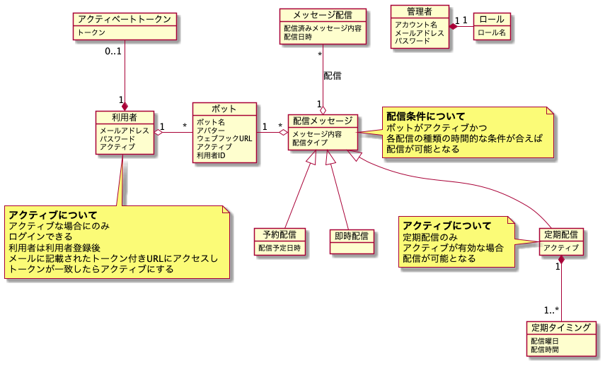
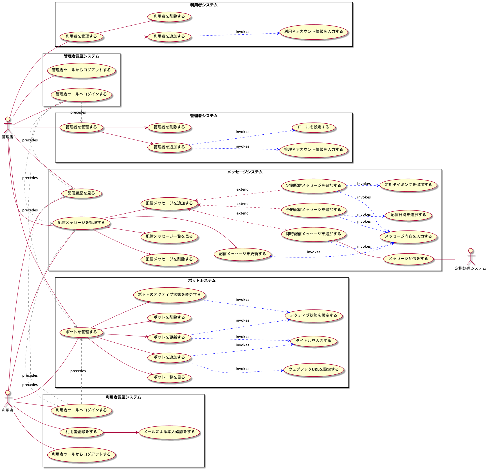
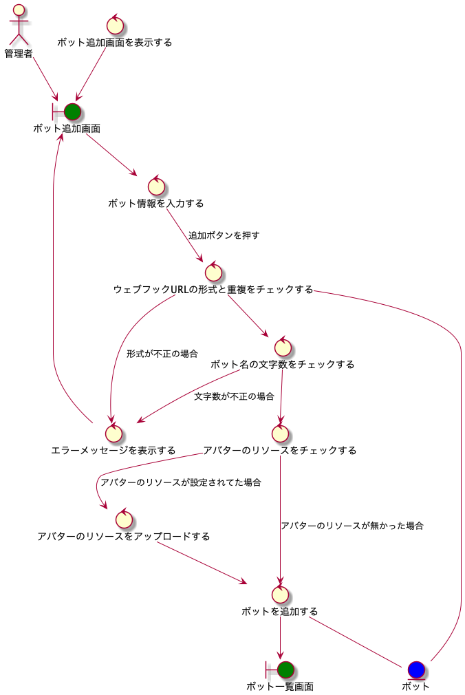
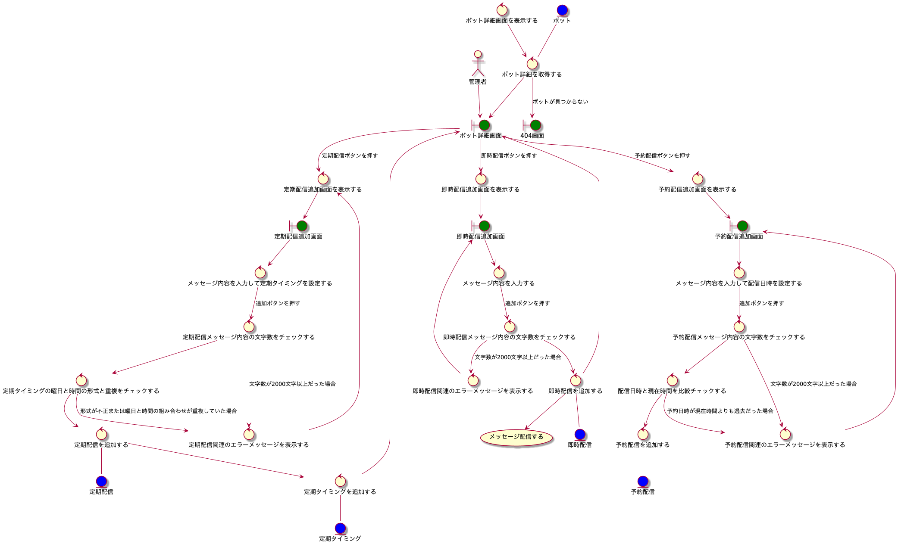
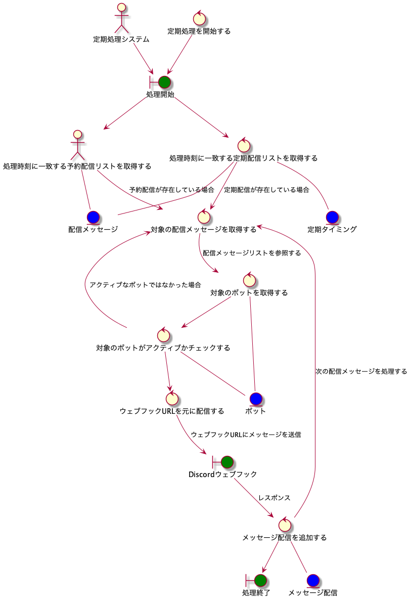
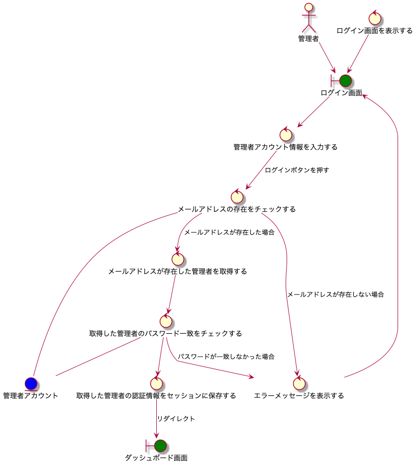
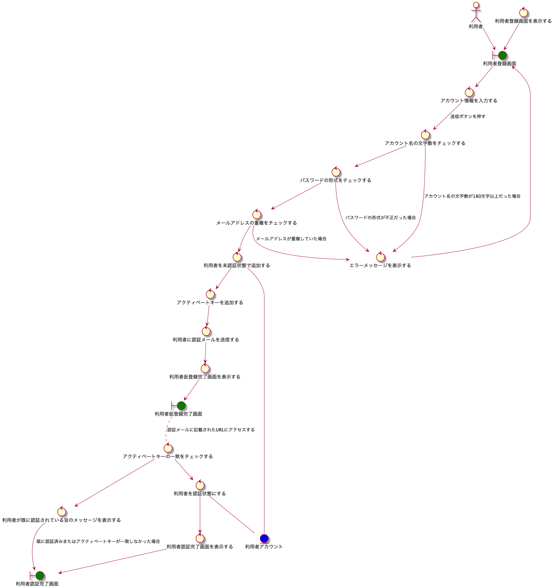

# 分析

分析では、この README の機能や用語集のほかに以下の plantUML で作成した図が含まれます。

- 概念モデル図
- ユースケース図（ユースケース記述は大事だが今回は書かない）
- ロバストネス図

※ ドメインを明らかにしていく過程で図などは修正・変更されていきます。  
つまり、この図を作成していく過程によってドメインが分析されていきます。

## 1. 機能

### <b>Discord ボット</b>

Discord のウェブフック情報を設定してボットを追加できます。  
ボットを追加することで、ウェブフックに対応したチャンネルに対する配信メッセージを追加していくことができます。  
追加したボットは一覧管理します。

### <b>配信メッセージ</b>

追加したボットに対して配信するメッセージを追加できます。  
メッセージには「予約配信・定期配信・即時配信」という配信タイプを設定でき、配信タイプによって配信処理を行うタイミングをコントロールできます。  
追加した配信メッセージは、追加日時順で一覧管理します。

### <b>メッセージ配信</b>

配信メッセージとして追加したものを、ボットに設定したウェブフックでメッセージ配信処理を行います。  
配信が完了したメッセージは、配信履歴として一覧で確認できます。  
配信処理のタイミングについては以下の配信タイプに分けられます。

#### <b>予約配信</b>

指定した日時に対象メッセージを配信する。

#### <b>定期配信</b>

指定した曜日の時間に定期的に対象メッセージを配信する。  
曜日と時間のセット（定期タイミング）は複数追加できる。

#### <b>即時配信</b>

配信メッセージを追加したタイミングで対象メッセージを配信する。

### <b>管理者アカウント</b>

管理者として管理画面にログイン・ログアウトすることができ、ボットや配信メッセージ機能を利用できるユーザーアカウントを追加できます。  
管理者にはロールを設定でき、ロールによってアクセスできる画面や、利用できる機能をコントロールします。  
追加したアカウントは、追加日時順で一覧管理します。

## 2. 用語集

※ いわゆるユビキタス言語の事です。

| 日本語                 | 英語            | 内容                                                                           |
| ---------------------- | --------------- | ------------------------------------------------------------------------------ |
| ボット                 | bot             | Discord の Bot です。                                                          |
| メッセージ配信         | sent message    | 追加した配信メッセージをボット情報を利用して送信する                           |
| 配信メッセージ         | post message    | アプリから Discord の Bot で送信するメッセージ                                 |
| 配信タイプ             | message type    | 配信メッセージに設定できる配信処理に関するタイプ                               |
| 予約配信               | schedule post   | メッセージを日時を指定して配信すること                                         |
| 定期配信               | regular post    | メッセージを毎週決まった曜日と時間を指定して配信すること                       |
| 即時配信               | immediate post  | メッセージを追加したタイミングで配信すること                                   |
| 定期タイミング         | regular timing  | 定期配信の曜日と時間がセットになった配信タイミング                             |
| 配信履歴               | message history | 配信済みのメッセージの履歴                                                     |
| 管理者・管理者カウント | admin           | ログインして機能を利用できるアカウント                                         |
| ロール                 | role            | 管理者アカウントに設定できる権限                                               |
| 利用者                 | user            | ログインをして管理画面利用してボットや配信メッセージ機能を利用できるアカウント |

## 3. 概念モデル

## 4. ユースケース

※ 2021/10/13 更新

## 5. ロバストネス分析

### ボットを追加する（旧）

### 配信メッセージを追加する（旧）

### メッセージ配信する（旧）

### ログインする

### 利用者登録認証

